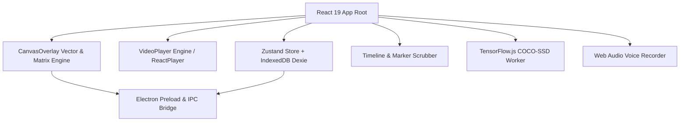

# 🏛️ Architecture & System Design

Technical architecture and engineering specifications for **Video Annotation Tool**.

---

## 🧩 High-Level Architecture



---

## 📂 Project Structure

```
video-annotation-tool/
├── backend/                  # Electron main process & IPC handlers
│   ├── main.cjs             # Window lifecycle, secure dialogs, sandboxed IPC
│   └── preload.cjs          # Context-isolated safe API bridge
├── src/                      # React 19 Client Application
│   ├── components/          # Reusable modular UI components
│   │   ├── CanvasOverlay.jsx# Drawing engine, ref-synchronized rendering
│   │   ├── VideoPlayer.jsx  # Native HTML5 & YouTube iframe player
│   │   ├── Timeline.jsx     # Visual scrubber, markers, frame steps
│   │   ├── Toolbar.jsx      # Liquid Glass floating control dock
│   │   ├── Sidebar.jsx      # Notes, audio voice memos & search
│   │   ├── LayerManager.jsx # Multi-layer ordering, opacity & visibility
│   │   └── SettingsPanel.jsx# Settings, shortcuts & storage manager
│   ├── services/            # Core business logic
│   │   ├── aiService.js     # TensorFlow.js COCO-SSD object detection
│   │   ├── database.js      # Dexie IndexedDB client persistence
│   │   └── exportService.js # PNG, SVG, CSV and JSON formatters
│   ├── store/               # State management
│   │   └── useStore.js      # Zustand store with partial persistence
│   ├── themes/              # Design systems (Liquid Glass, Dark, Light)
│   ├── utils/               # Coordinate mapping, storage, shortcuts
│   └── App.jsx              # Main view & shortcut orchestrator
├── config/                   # Default configuration schemas
├── docs/                     # Full technical & user guides
└── tests/                    # Unit & integration test suites
```

---

## ⚙️ Core Subsystems

### 1. Canvas Vector & Scale Engine
- Coordinates are computed with aspect-ratio preservation:
  $$\text{scaleX} = \frac{\text{canvas.width}}{\text{rect.width}}, \quad \text{scaleY} = \frac{\text{canvas.height}}{\text{rect.height}}$$
- Drawing actions and transient frame snapshots run on synchronous references (`useRef`), ensuring zero UI lag and no React 19 render tearing at 60 FPS.
- Multi-layer canvas compositing with independent opacity and visibility controls.

### 2. On-Device AI Engine
- Models run 100% locally via WebGL backend (`@tensorflow/tfjs-backend-webgl`) with fallback to CPU.
- COCO-SSD is lazy-loaded on first demand to prevent initial startup latency and bundle bloat.

### 3. Data & Storage Model
- Local project storage powered by **Dexie.js** (IndexedDB) with auto-save scheduling.
- Export pipelines:
  - **PNG Snapshot**: High-res raster compositing with video frame capture.
  - **JSON**: Full project restore with layers and annotations.
  - **CSV**: RFC 4180 compliant timestamped bookmarks.
